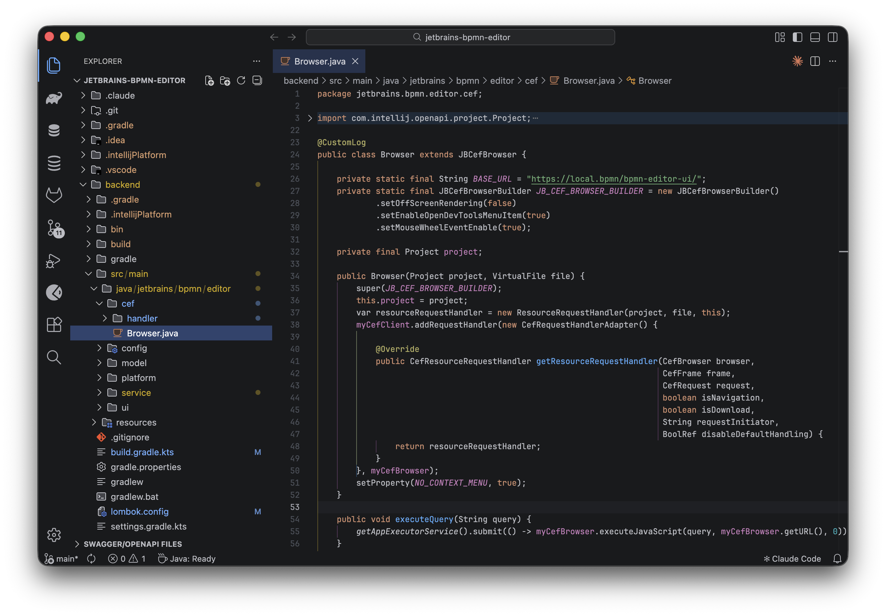
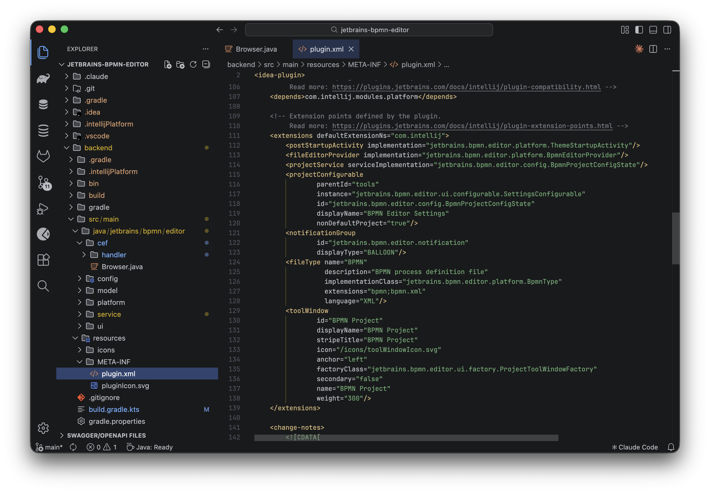
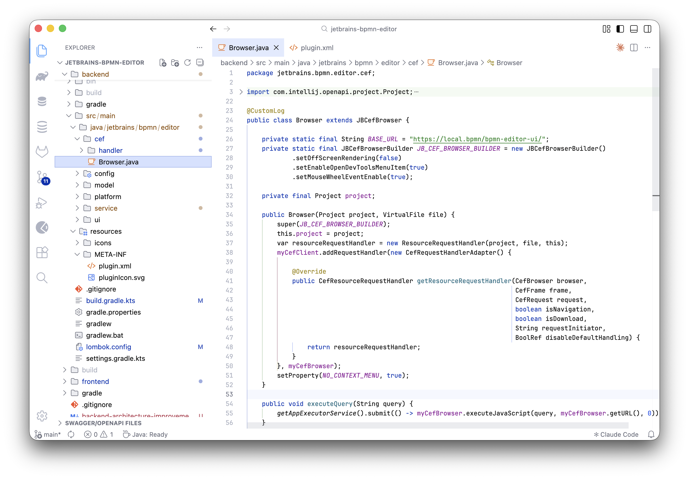
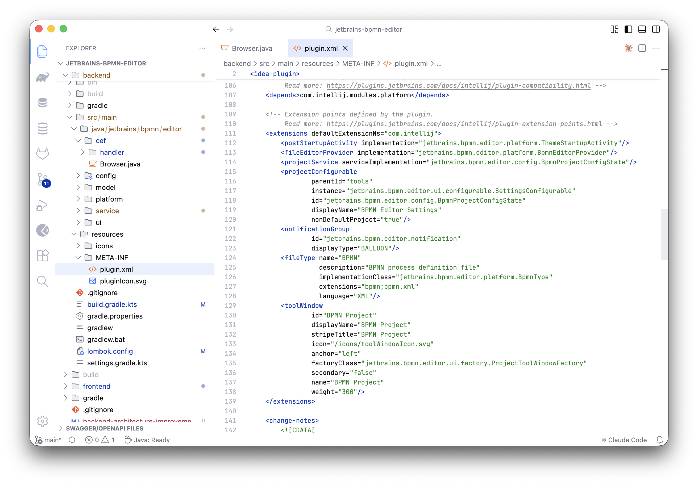

# IntelliJ IDEA Islands Theme for VS Code

Dark and Light themes for Visual Studio Code inspired by IntelliJ IDEA Islands color scheme.

## Screenshots

### IntelliJ IDEA Islands Dark

A modern dark theme with carefully selected colors for comfortable coding sessions.





### IntelliJ IDEA Islands Light

A clean light theme with optimal contrast and readability.





## Features

- Authentic IntelliJ IDEA Islands color palette
- Optimized syntax highlighting for:
  - Java, Kotlin, Groovy, Scala
  - TypeScript, JavaScript, JSX/TSX
  - Python, Go, Rust, C/C++, C#
  - HTML, CSS, JSON, YAML, XML
  - Markdown, SQL, Shell, and more
- Consistent UI styling across all VS Code elements
- Support for semantic highlighting

## Installation

### From VS Code Marketplace

1. Open Extensions view (`Ctrl+Shift+X` / `Cmd+Shift+X`)
2. Search for `IntelliJ IDEA Islands Theme`
3. Click **Install**
4. Open Command Palette (`Ctrl+Shift+P` / `Cmd+Shift+P`)
5. Select `Preferences: Color Theme`
6. Choose **IntelliJ IDEA Islands Dark** or **IntelliJ IDEA Islands Light**

### Manual Installation

1. Clone or download this repository
2. Copy to VS Code extensions folder:
   - **Windows:** `%USERPROFILE%\.vscode\extensions`
   - **macOS:** `~/.vscode/extensions`
   - **Linux:** `~/.vscode/extensions`
3. Restart VS Code
4. Select the theme from Color Theme picker

## Recommended Settings

For the best experience, add these settings to your `settings.json`:

```json
{
  "editor.fontFamily": "JetBrains Mono, Fira Code, monospace",
  "editor.fontLigatures": true,
  "editor.fontSize": 14,
  "editor.lineHeight": 1.6,
  "editor.semanticHighlighting.enabled": true
}
```

## Contributing

Contributions, issues, and feature requests are welcome!
Feel free to [open an issue](https://github.com/a-havrysh/vscode-intellij-theme/issues) or submit a pull request.

## Author

**Oleksandr Havrysh**

- GitHub: [@a-havrysh](https://github.com/a-havrysh)

## License

[MIT](LICENSE)

---

**Not affiliated with JetBrains or IntelliJ IDEA.**
All trademarks are property of their respective owners.
